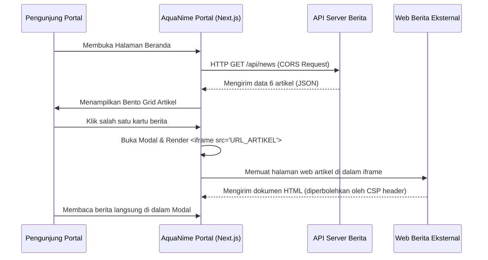

# Dokumentasi Integrasi Iframe & API Berita

Dokumen ini menjelaskan mekanisme integrasi antara **AquaNime Portal** (Frontend) dengan **Website Berita Eksternal** (Next.js/WordPress/CMS lain) menggunakan metode hibrida: **JSON API** untuk daftar bento grid, dan **Embedded HTML5 Iframe** untuk membaca konten artikel secara instan di dalam portal.

---

## 🛠️ Alur Kerja Integrasi



---

## 1. Integrasi API Berita (JSON Fetching)

Frontend AquaNime memanggil API berita secara dinamis melalui konstanta `NEWS_API_URL` di `src/components/sections/ArticlesSection.tsx` (baris 80).

### Skema Response JSON yang Diharapkan:
Backend wajib menyediakan data berformat JSON Array maksimal berisi **6 item terbaru** dengan struktur key berikut:

```json
[
  {
    "id": "1",
    "title": "AquaNime Fest 2025: Rayakan Budaya Pop-Kultur Jepang Bersama Komunitas",
    "excerpt": "Event tahunan terbesar AquaNime kembali hadir dengan panggung cosplay...",
    "category": "Event",
    "date": "15 Jan 2025",
    "readTime": "4 min read",
    "image": "https://news.aquanime.org/images/news-1.png",
    "url": "https://news.aquanime.org/posts/aquanime-fest-2025"
  }
]
```

### Konfigurasi CORS (Cross-Origin Resource Sharing):
Karena API diakses secara langsung oleh browser user dari domain portal (`https://aquanime.org` atau `http://localhost:3000`), backend Anda harus mengizinkan CORS. 

**Contoh Header Response API:**
```http
Access-Control-Allow-Origin: *
Access-Control-Allow-Methods: GET, OPTIONS
Access-Control-Allow-Headers: Content-Type
```

---

## 2. Integrasi Modal Iframe Reader

Ketika berita di-klik, modal akan merender tag iframe:

```tsx
<iframe
  src={activeIframeUrl}
  title={activeTitle}
  className="h-full w-full border-0"
  sandbox="allow-scripts allow-same-origin allow-popups allow-forms"
/>
```

 agar browser tidak memblokir render halaman tersebut di dalam portal, website tujuan (`activeIframeUrl`) **harus dikonfigurasi** agar mengizinkan pemuatan frame.

### A. Konfigurasi jika Web Berita Eksternal menggunakan Next.js
Tambahkan Header `Content-Security-Policy` (`frame-ancestors`) di file `next.config.js` web berita:

```javascript
// next.config.js di Website Berita Anda
const nextConfig = {
  async headers() {
    return [
      {
        // Terapkan izin frame ke seluruh halaman artikel berita Anda
        source: "/posts/:path*", 
        headers: [
          {
            key: "Content-Security-Policy",
            value: "frame-ancestors 'self' https://aquanime.org http://localhost:3000",
          },
        ],
      },
    ];
  }
};

module.exports = nextConfig;
```

### B. Konfigurasi jika Web Berita Eksternal menggunakan Nginx
Jika situs berita Anda dideploy menggunakan server Nginx, tambahkan baris berikut pada file konfigurasi server blocks Nginx Anda:

```nginx
# Izinkan domain portal AquaNime memuat frame
add_header Content-Security-Policy "frame-ancestors 'self' https://aquanime.org http://localhost:3000";
```

### C. Konfigurasi jika Web Berita Eksternal menggunakan Apache (`.htaccess`)
Tambahkan aturan berikut di file `.htaccess`:

```apache
Header set Content-Security-Policy "frame-ancestors 'self' https://aquanime.org http://localhost:3000"
```

---

## 🛡️ Catatan Penting Mengenai Keamanan & UX

1. **Sandbox attribute**: Nilai `sandbox="allow-scripts allow-same-origin allow-popups allow-forms"` sengaja disematkan untuk membatasi eksekusi berbahaya seperti top-level redirection otomatis (yang dapat memaksa user keluar dari portal AquaNime) sekaligus menjaga agar script esensial visual di web berita Anda tetap berjalan normal.
2. **Fallback Button**: Frontend menyediakan tombol **"Buka di Tab Baru"** di bagian atas modal sebagai opsi cadangan (fallback) jika web eksternal memblokir iframe (misal karena CSP ketat) atau jika koneksi lambat.
